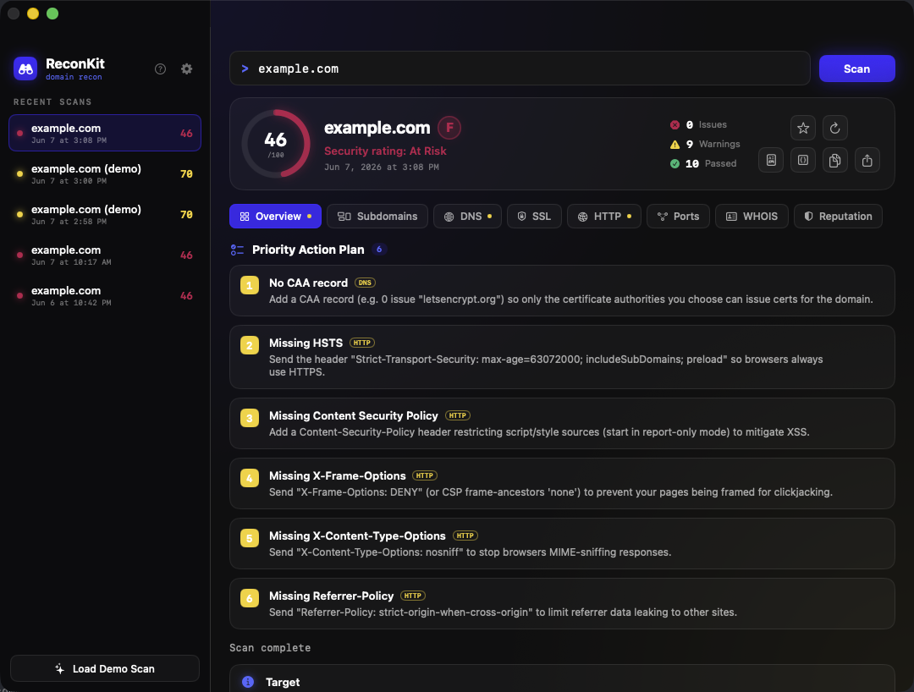
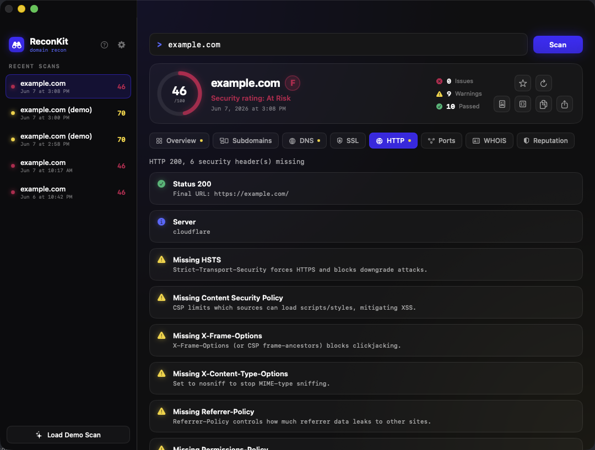
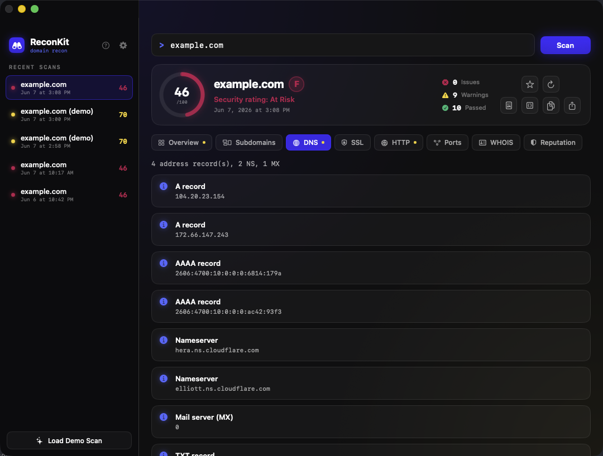
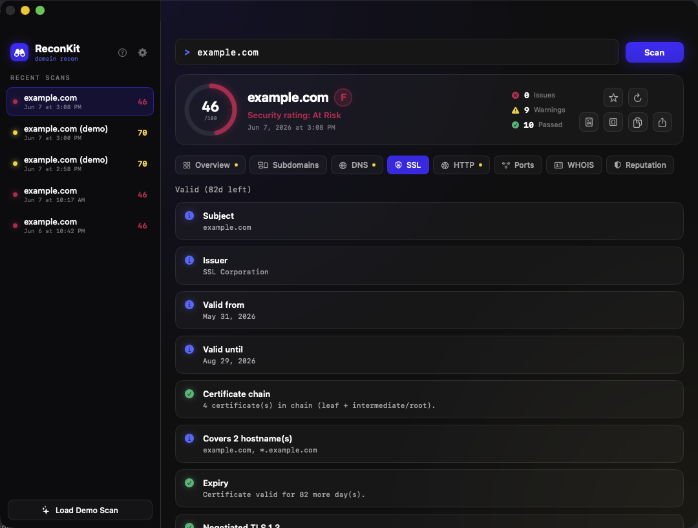
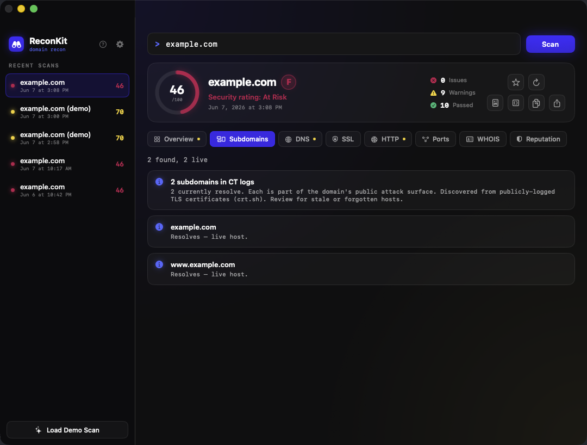
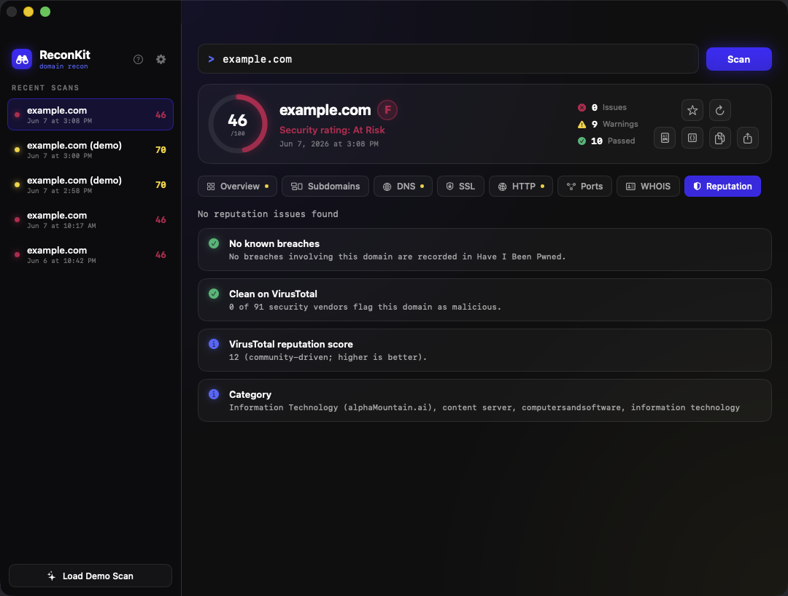

# ReconKit — Domain reconnaissance for macOS

**Free, open-source, native macOS app for domain reconnaissance.** ReconKit replaces the dozen tools and browser tabs you'd normally juggle — `dig`, `whois`, `openssl`, `nmap`, crt.sh, securityheaders, Have I Been Pwned, URLhaus, VirusTotal — with a single scan that compiles DNS, subdomains, SSL, HTTP, ports, WHOIS, and reputation into one ranked report you can export to PDF. Every probe runs locally on your Mac.

<p align="center">
  
</p>

- **Website:** https://reconkit.fromthescope.com
- **Docs:** https://reconkit.fromthescope.com/docs.html
- **Download:** [latest release](https://github.com/melxusgid/reconkit/releases/latest)

> ReconKit performs **passive, surface-level** reconnaissance against publicly reachable endpoints. Only scan domains you own or are authorized to assess.

## The 8 scan modules

| Module | What it does |
|--------|--------------|
| **Overview** | Roll-up of the run: target, reachability, top warnings, security score. |
| **Subdomains** | Discovered from Certificate Transparency logs (crt.sh), then resolved for live hosts. |
| **DNS** | A, AAAA, MX, NS, TXT, SOA records plus SPF, DMARC, DNSSEC and CAA hygiene. |
| **SSL** | Certificate subject, issuer, validity window, and accepted TLS versions. |
| **HTTP** | Status/redirects, security headers (HSTS, CSP, …), server banner, tech stack. |
| **Ports** | TCP handshake against 15 common ports, with banner grabs on plaintext services. |
| **WHOIS** | Registrar, creation/expiry dates, and domain status via the authoritative registry. |
| **Reputation** | Have I Been Pwned and URLhaus for free; add your own VirusTotal key for 90+ vendors. |

Findings are graded **Pass / Info / Warning / Issue** and distilled into a 0–100 security score (letter grade A–F).

## Screenshots

<table>
  <tr>
    <td width="50%"><br><sub><b>HTTP</b> — security headers, flagged worst-first</sub></td>
    <td width="50%"><br><sub><b>DNS</b> — records plus SPF/DMARC/DNSSEC/CAA</sub></td>
  </tr>
  <tr>
    <td width="50%"><br><sub><b>SSL</b> — certificate, chain, negotiated TLS</sub></td>
    <td width="50%"><br><sub><b>Subdomains</b> — from Certificate Transparency logs</sub></td>
  </tr>
  <tr>
    <td width="50%"><br><sub><b>Reputation</b> — HIBP, URLhaus, VirusTotal</sub></td>
    <td width="50%"></td>
  </tr>
</table>

> Screenshots show a real scan of <code>example.com</code> — the same results the built-in demo reproduces.

## Install

1. Download `ReconKit.dmg` from the [latest release](https://github.com/melxusgid/reconkit/releases/latest) (~2.2 MB).
2. Open the DMG and drag **ReconKit** into `/Applications`.
3. **Launch it** — just double-click. ReconKit is signed with an Apple Developer ID and notarized by Apple, so it opens with no Gatekeeper warning.

Requires **macOS 13 (Ventura)** or later, Apple Silicon or Intel.

## Build from source

No external dependencies — a standard Xcode project.

```sh
git clone https://github.com/melxusgid/reconkit.git
cd reconkit
xcodebuild -project ReconKit.xcodeproj -scheme ReconKit -configuration Release build
```

Requires Xcode 15+. Select your own signing team under Signing & Capabilities for a local signed build.

## Privacy

- **No telemetry, no accounts.** ReconKit has no backend and collects nothing about you.
- **Scans run locally.** Probes go directly from your Mac to the target and the named public data sources (crt.sh, Have I Been Pwned, URLhaus, VirusTotal) — never through ReconKit.
- **Sandboxed.** Runs under the macOS App Sandbox with only network-client and user-selected file (for export) entitlements.
- **Your key stays yours.** The optional VirusTotal API key is stored on-device and only ever sent to VirusTotal.

## License

MIT. Built by [FromTheScope](https://fromthescope.com).
